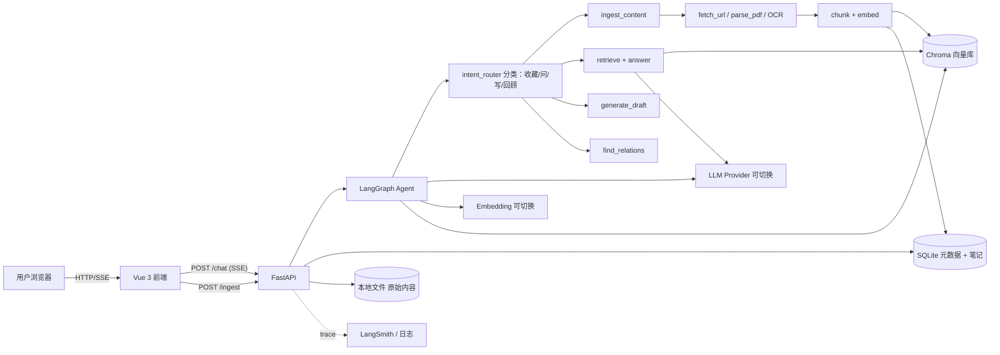
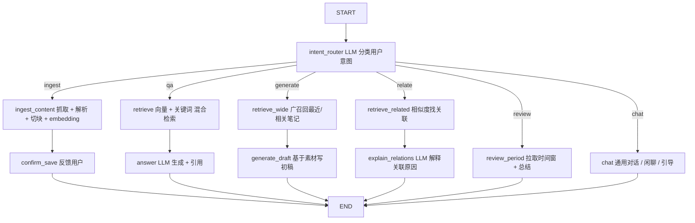

# 个人知识库 / Second Brain Agent — 项目计划书

> 一个本地优先的个人知识库 Agent：收藏网页/PDF/文章 → 自动解析、向量化、归纳 → 用自然语言与你的"第二大脑"对话。
> 支持**多模型自由切换**（OpenAI / Anthropic / DeepSeek / 智谱 / Ollama / ...），换模型只改配置，不改代码。

---

## 1. 项目概述

### 1.1 一句话定位
**用自然语言跟自己的知识库对话**：收藏什么、怎么问、写什么——全由 LLM 当入口，模型可选可换。

### 1.2 核心能力
- **收藏**：URL / PDF / 纯文本 / 图片（OCR）一键入库，自动打标签、做摘要
- **检索**：自然语言提问 → 语义检索 + 关键词检索 → 答案带原文引用（页码/段落）
- **整理**：自动聚类、找关联笔记、生成知识图谱视图（可选）
- **创作**：基于已有知识起草文章、写周报、做对比分析
- **回顾**：每日/每周自动推送"你最近读了什么、可以连成什么"

### 1.3 与同类产品的差异
| 维度 | Notion AI / Mem | 本项目 |
|---|---|---|
| 数据主权 | 云端 | **本地优先**（向量库 / 笔记都在自己机器上）|
| 模型选择 | 绑死 | **任意切换**（OpenAI/Claude/DeepSeek/Ollama）|
| 抓取能力 | 弱 | URL 抓取 + PDF + 图片 OCR + RSS |
| Agent 能力 | 单轮补全 | 多步规划：先检索 → 再总结 → 再创作 |
| 可二次开发 | 否 | 全开源，可加节点/工具 |

### 1.4 目标用户
- **自用**：重度内容消费者（开发者 / 研究者 / 产品经理 / 投资者）
- **后续**：小团队内部知识库（多租户版）

---

## 2. 范围与目标

### 2.1 MVP 目标
- [ ] 支持 URL / PDF / 纯文本 3 种入库方式
- [ ] 自然语言问答，答案带**引用片段**（哪篇文章、哪段）
- [ ] 至少接入 2 个 LLM 提供商（OpenAI + 一个国内/本地）并可在前端切换
- [ ] 至少 2 个 embedding 方案（BGE 本地 + OpenAI Embedding）
- [ ] 笔记列表 / 详情页 + 聊天页 双视图
- [ ] LangGraph 流程可视化（langgraph dev）

### 2.2 非目标（MVP 不做）
- 多用户 / 鉴权 / 权限
- 实时协作（飞书/Notion 双向同步）
- 知识图谱可视化（V2）
- 移动端 App（V2）
- 跨设备同步（先用本地存储）

---

## 3. 核心用户场景

### 场景 A：随手收藏
> 用户：粘贴一个公众号链接
> Agent：抓取正文 → 切 chunk → embedding → 入库 → 反馈"已收藏，主题标签：AI Agent / LangGraph，约 3200 字"
> 用户：5 秒后问"刚才那篇讲了什么" → 立刻调出摘要

### 场景 B：跨篇综合问答
> 用户："我之前读的关于 RAG 的文章，主要分几派？各自的代表观点是？"
> Agent：语义检索召回 Top-K 片段 → 按观点聚类 → 生成结构化回答，每条结论后附引用 [1][2][3]

### 场景 C：基于已有知识的创作
> 用户："基于我最近一个月收藏的 AI 产品，写一份值得关注的 10 个产品清单"
> Agent：拉取最近 30 天的笔记 → 去重/聚类 → 写初稿 → 引用每条事实回原文

### 场景 D：关联发现
> 用户："我那篇关于 onboarding 的笔记，跟哪些其他笔记相关？"
> Agent：向量相似度 + 关键词共现 → 找出 5 篇最相关 → 解释"为什么相关"

### 场景 E：模型切换的价值
> 用户：把模型从 GPT-4o-mini 切到本地 Ollama qwen2.5:7b → 重新问同一个问题
> 目的：省钱 / 数据不出本地 / 对比效果

---

## 4. 技术栈

| 层 | 选型 | 理由 |
|---|---|---|
| Agent 框架 | **LangGraph (Python)** | 状态图清晰、可视化好、节点化天然适配 RAG pipeline |
| LLM 抽象 | **LangChain init_chat_model** | 一行代码切换 7+ 提供商；自带工具调用 |
| LLM 提供商 | OpenAI / Anthropic / DeepSeek / 智谱 GLM / 月之暗面 / Ollama | 通过配置切换；详见 §8 |
| Embedding | **BGE-M3**（默认本地）/ OpenAI text-embedding-3-small / M3E | 中英双语友好；可换 |
| 向量库 | **Chroma**（MVP）→ Qdrant（生产）| Chroma 文件级，零依赖；后期换 Qdrant 支持分布式 |
| 元数据库 | **SQLite + SQLModel** | 单文件、零运维；后期换 Postgres |
| 抓取 | **trafilatura**（网页）/ **pypdf**（PDF）/ **PaddleOCR**（图片，可选）| 三个库覆盖 90% 场景 |
| 后端服务 | **FastAPI** | 异步、SSE、OpenAPI |
| 前端 | **Vue 3 + TypeScript + Vite + Pinia + Naive UI** | 风格统一、好用 |
| 协议 | REST + SSE | 简单清晰 |
| 包管理 | **uv (Python)** + **pnpm (前端)** | 现代、快 |
| 部署 | 后端 Docker；前端 Vercel / Nginx | MVP 阶段 |

---

## 5. 系统架构



**关键设计**：
- 前端 → FastAPI → Agent；Agent 内部分流到不同子图
- 向量库和元数据库解耦，便于后期换
- 模型/embedding 切换对**业务代码完全透明**（工厂模式）

---

## 6. Agent 设计

### 6.1 State Schema
```python
class AgentState(TypedDict):
    messages: Annotated[list[BaseMessage], add_messages]
    session_id: str

    intent: Literal["ingest", "qa", "generate", "review", "relate", "chat"]

    # 入库相关
    pending_content: str | None         # URL / 文本 / 文件路径
    content_type: Literal["url", "pdf", "text", "image"] | None
    ingested_note_id: str | None

    # 检索相关
    query: str | None
    retrieved_chunks: list[Chunk]       # 召回片段
    citations: list[Citation]           # 引用信息

    # 生成相关
    draft: str | None

    # 控制
    step_count: int
```

### 6.2 Graph 拓扑



### 6.3 节点职责
| 节点 | 输入 | 输出 | 实现 |
|---|---|---|---|
| intent_router | messages | intent | LLM function-calling，返回 enum |
| ingest_content | pending_content + content_type | ingested_note_id | 工具组合：抓取/解析 → chunk → embed → 入库 |
| retrieve | query | retrieved_chunks | 混合检索：向量 top-k + BM25 |
| answer | query + retrieved_chunks | messages (assistant) + citations | LLM 带引用的 prompt |
| generate_draft | query + 广召回 | draft | LLM 写作 |
| find_relations | note_id | related + 解释 | 向量相似 + LLM 解释 |
| review_period | time_range | summary | 拉笔记 + LLM 总结 |

### 6.4 工具清单
| 工具 | 作用 | 实现 |
|---|---|---|
| fetch_url | 抓网页正文 | trafilatura |
| parse_pdf | 解析 PDF | pypdf / pdfplumber |
| ocr_image | 图片 OCR | PaddleOCR（可选）|
| chunk_text | 切块 | 滑动窗口 + 重叠，按段落/标题 |
| embed_texts | embedding | 工厂：OpenAI / BGE / M3E |
| vector_search | 语义检索 | Chroma query |
| keyword_search | 关键词检索 | SQLite FTS5 |
| save_note | 入库 | 写 SQLite + Chroma |
| list_recent | 列最近笔记 | SQLite query |
| get_note | 查笔记 | SQLite |

---

## 7. 数据模型

### 7.1 笔记（Note）
```json
{
  "id": "n_abc123",
  "title": "LangGraph 入门：从状态机到多 Agent",
  "source_type": "url",
  "source_url": "https://...",
  "content_path": "/data/notes/n_abc123.md",
  "summary": "本文介绍 LangGraph 的核心概念...",
  "tags": ["AI", "Agent", "LangGraph"],
  "word_count": 3240,
  "created_at": "2026-07-03T10:00:00Z",
  "embedded": true
}
```

### 7.2 文档块（Chunk）
```json
{
  "id": "c_xyz",
  "note_id": "n_abc123",
  "text": "LangGraph 的核心理念是...",
  "chunk_index": 3,
  "embedding_id": "vec_uuid",
  "metadata": {"section": "核心概念", "page": null}
}
```

### 7.3 会话（Session）
```json
{
  "session_id": "uuid",
  "created_at": "...",
  "messages": [...]
}
```

---

## 8. 多模型接入设计（重点）

### 8.1 设计目标
> **业务代码不感知模型**。换 OpenAI → DeepSeek → 本地 Ollama，只改 `.env`，不改 Python。

### 8.2 配置文件
```env
# .env
LLM_PROVIDER=openai              # openai | anthropic | deepseek | zhipu | moonshot | ollama
LLM_MODEL=gpt-4o-mini
LLM_API_KEY=sk-xxx
LLM_API_BASE=                    # 可选，自定义网关

EMBEDDING_PROVIDER=bge           # bge | openai | m3e
EMBEDDING_MODEL=BAAI/bge-m3
EMBEDDING_DEVICE=cpu             # cpu | cuda
```

### 8.3 抽象层
```python
# app/llm/factory.py
from langchain.chat_models import init_chat_model
from langchain.embeddings import init_embeddings

def get_llm():
    return init_chat_model(
        model=os.getenv("LLM_MODEL"),
        model_provider=os.getenv("LLM_PROVIDER"),
        api_key=os.getenv("LLM_API_KEY"),
        base_url=os.getenv("LLM_API_BASE") or None,
        temperature=0.3,
    )

def get_embeddings():
    return init_embeddings(
        model=os.getenv("EMBEDDING_MODEL"),
        provider=os.getenv("EMBEDDING_PROVIDER"),
    )
```

**业务代码**永远只写：
```python
from app.llm.factory import get_llm, get_embeddings
llm = get_llm()
llm.invoke(messages)   # 任何 provider 都一样
```

### 8.4 支持的提供商清单（MVP）
| Provider | 用途 | 备注 |
|---|---|---|
| OpenAI | 默认 LLM | GPT-4o / GPT-4o-mini |
| Anthropic | 高质量回答 | Claude Sonnet / Haiku |
| DeepSeek | 国产便宜 | deepseek-chat / deepseek-reasoner |
| 智谱 GLM | 国产 GLM-4 | 中文强 |
| 月之暗面 Kimi | 国产长文本 | 长上下文 |
| Ollama | 本地 | qwen2.5 / llama3 / gemma（**数据不出本机**）|
| 硅基流动 | 聚合 API | 一个 key 调多家 |

**Embedding**：
| Provider | 模型 | 用途 |
|---|---|---|
| BGE-M3 | BAAI/bge-m3 | 默认，中英双语、本地免费 |
| OpenAI | text-embedding-3-small | 英文为主，质量高 |
| M3E | moka-ai/m3e-large | 中文社区方案 |

### 8.5 前端模型选择
- 设置页 dropdown：列出已配置的 provider + 模型
- 选择后存到 localStorage，**每次请求带在 header**
- 后端按 header 覆盖 env（实现**会话级切换**）
- 切换时给"已切换至 XXX，能力差异提示"（比如 GPT-4o-mini 工具调用稳，qwen2.5 便宜但工具调用偶尔出错）

### 8.6 切换时的注意事项
- **不同模型 embedding 不通用**：换 embedding 后需要**重建向量库**（一次性脚本）
- **不同模型上下文长度不同**：长 PDF 解析时按当前模型上限切块
- **不同模型工具调用能力不同**：小模型（7B）可能工具调用不稳定 → 关键工具加 fallback 逻辑

---

## 9. API 设计

### 9.1 REST
| Method | Path | 用途 |
|---|---|---|
| POST | /api/notes | 入库（body 含 url 或 text）|
| GET | /api/notes | 列出笔记（分页/筛选）|
| GET | /api/notes/{id} | 笔记详情 |
| DELETE | /api/notes/{id} | 删除笔记 |
| POST | /api/chat | **SSE 流式对话**（可带 X-LLM-Provider 头）|
| GET | /api/settings/models | 列出已配置的可用模型 |

### 9.2 SSE 事件类型
```
event: message
data: {"delta": "..."}

event: intent
data: {"intent": "qa"}

event: retrieved
data: {"chunks": [{"note_id": "n_abc", "title": "...", "snippet": "...", "score": 0.83}]}

event: citations
data: {"citations": [{"note_id": "n_abc", "title": "...", "chunk_index": 3}]}

event: note_saved
data: {"note_id": "n_abc", "summary": "..."}

event: draft
data: {"delta": "..."}

event: done
data: {}
```

---

## 10. 前端设计

### 10.1 页面
- /chat — 主对话页（默认）
- /notes — 笔记列表
- /notes/:id — 笔记详情（含 chunk 视图、引用回链）
- /settings — 模型选择、Provider 配置入口（仅显示，不改 env）

### 10.2 核心组件
- ChatPanel / MessageBubble
- NoteCard / NoteList
- IngestDialog（粘贴 URL / 拖文件 / 粘贴文本）
- CitationBlock（带 hover 预览的引用）
- ModelSelector（dropdown）
- StreamIndicator（"正在抓取网页…" / "正在 embedding…" / "正在检索…"）

### 10.3 关键交互
1. 用户粘贴 URL → 立即入库 → 反馈"已收藏：xxx"
2. 用户提问 → 流式输出答案 + 引用卡片（可点开看原文）
3. 用户问"我之前读过的 X 相关文章" → 列出 Top 笔记卡片
4. 用户切换模型 → 顶部 banner 提示"已切换至 DeepSeek"，后续请求走新模型

---

## 11. 目录结构

```
one_agent/
├── docs/
│   └── PLAN.md
├── backend/
│   ├── pyproject.toml
│   ├── .env.example
│   ├── app/
│   │   ├── main.py
│   │   ├── api/
│   │   │   ├── chat.py
│   │   │   ├── notes.py
│   │   │   └── settings.py
│   │   ├── agent/
│   │   │   ├── state.py
│   │   │   ├── graph.py
│   │   │   ├── nodes/
│   │   │   │   ├── intent_router.py
│   │   │   │   ├── ingest.py
│   │   │   │   ├── retrieve.py
│   │   │   │   ├── answer.py
│   │   │   │   ├── generate.py
│   │   │   │   ├── relate.py
│   │   │   │   └── review.py
│   │   ├── tools/
│   │   │   ├── fetch_url.py
│   │   │   ├── parse_pdf.py
│   │   │   ├── chunk.py
│   │   │   ├── search.py
│   │   │   └── store.py
│   │   ├── llm/
│   │   │   ├── factory.py        # 关键：模型工厂
│   │   │   └── providers.py
│   │   ├── data/
│   │   │   ├── chroma/          # 向量库
│   │   │   └── notes/           # 原始文件
│   │   ├── storage/
│   │   │   ├── db.py
│   │   │   └── models.py
│   │   └── config.py
│   └── tests/
├── frontend/
│   ├── package.json
│   ├── vite.config.ts
│   ├── src/
│   │   ├── main.ts
│   │   ├── App.vue
│   │   ├── router/
│   │   ├── stores/
│   │   ├── api/
│   │   ├── components/
│   │   └── views/
│   └── public/
├── scripts/
│   └── rebuild_vectors.py        # 换 embedding 后重建
├── .gitignore
└── README.md
```

---

## 12. 开发路线图

| 阶段 | 内容 | 验收标准 |
|---|---|---|
| P0 计划 | 本文档 | 用户 review 通过 |
| P1 后端骨架 | FastAPI + LangGraph 空图 + /health + 模型工厂 | 切换 .env 中 LLM_PROVIDER 字段能跑通 |
| P2 入库链路 | 抓 URL / 解析 PDF / 切块 / embedding / 存 Chroma+SQLite | 给一个 URL 能入库并可搜 |
| P3 检索 + 问答 | 向量+关键词混合检索 / 答案带引用 | 问"X 是什么"能引用具体段落 |
| P4 Agent 化 | 6 个节点 + intent_router 跑通 | 存/问/写/关联/回顾 5 种意图都能走通 |
| P5 前端骨架 | Vue 3 + 路由 + Pinia + 聊天 + 笔记列表 | 能用假数据展示 |
| P6 端到端 | SSE / 引用卡片 / 入库对话框 | 浏览器跑通完整流程 |
| P7 多模型 | 接入 2-3 个 provider，前端可切换 | OpenAI / DeepSeek / Ollama 都能用 |
| P8 体验打磨 | Loading / 空状态 / 移动端 | Lighthouse >= 80 |
| P9 高级 | OCR / RSS 订阅 / 周报推送 | 至少 1 个能用 |

---

## 13. 风险与决策记录

| 风险 | 影响 | 应对 |
|---|---|---|
| 换 embedding 后向量不通 | 历史数据失效 | 一键重建脚本（scripts/rebuild_vectors.py）|
| 抓取失败 / 公众号反爬 | 入库中断 | trafilatura + playwright fallback；失败内容存草稿 |
| PDF 扫描件无文字层 | 解析为空 | 提示用户 OCR（PaddleOCR）|
| 不同模型工具调用能力差 | 小模型掉链子 | 关键工具 LLM 调用前加规则兜底 |
| 上下文超长 | 召回太多 token | retrieve 时 rerank，top-k 默认 5 |
| 本地磁盘膨胀 | 笔记多了慢 | 定期清理 chunk 缓存；图片存原始不存 embed |

**未来扩展**（不在 MVP）：
- 知识图谱（实体抽取 + 关系）
- 多用户 / 团队知识库
- 飞书 / Notion 双向同步
- 移动端 App
- 接入 MCP（让其他工具调用我的知识库）

---

## 14. 立即可做（下一步）

确认后按这个顺序开干：

1. **P1 后端骨架**：FastAPI + LangGraph 空图 + 模型工厂（**重点：先把多模型切换跑通**）
2. **P2 入库链路**：URL → 抓 → 切 → embed → 存，先用 BGE 本地
3. **P3 检索 + 问答**：先做最朴素的 RAG，不走 Agent，先验证
4. 之后加 Agent 化、前端、多模型切换

---

需要调整的方向、技术选型、Agent 流程、模型清单，告诉我我直接改。